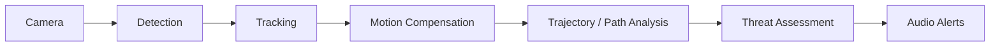

## Download for macOS

A self-contained Apple Silicon build is available.

[Download Atlas v0.1.0 for macOS](https://github.com/Hei-N/atlas-assistive-vision/releases/tag/v0.1.0)

- Apple Silicon only
- No Python installation required
- YOLOv8s bundled
- Camera permission required on first launch
- Not yet signed or notarized by Apple

> On first launch, macOS may block the app because it is not notarized. Right-click `Atlas.app` → **Open**. More instructions in the downloadable link.

# Atlas

Assistive computer-vision prototype that turns street hazards into short, prioritized audio alerts for blind and low-vision pedestrians.

Most vision systems stop at "what objects are in the frame?" Atlas also asks how those objects are moving, whether they matter to the user's walking path, and how urgently the user should be told. It runs on live video from a webcam or a file and speaks only what is relevant.

## How It Works



YOLOv8s detects people and vehicles, and each object is tracked across frames. Camera motion is estimated from optical flow and subtracted, so a moving camera does not make parked cars look like they are moving.

The compensated motion feeds approach detection, trajectory prediction and a check against a pedestrian corridor in the image. Each object gets a threat level, and only the most relevant hazards are spoken.

## Key Features

- Real-time detection and multi-object tracking (person, bicycle, motorcycle, car, bus, truck)
- Camera-motion estimation and compensation, with confidence checks
- Approach, trajectory and pedestrian-path conflict analysis
- Conflict-imminence estimation
- Five-level Threat Assessment with temporal persistence
- Hazard prioritization across multiple objects
- Minimal / Balanced / Detailed audio modes
- System-health monitoring (camera blocked, feed lost, detection unavailable)
- Detector benchmarking and evaluation scripts

## Threat Levels

1. Normal Movement: moving, not close or approaching
2. Nearby Presence: close, no confirmed approach
3. Confirmed Approach: closing in over several frames
4. Path Conflict: predicted path crosses the user's corridor
5. Immediate Danger: close, approaching and on a conflicting path

## Audio Design

Atlas avoids constant narration. Alerts are short and directional, and one message is spoken at a time. Warnings are spoken before informational messages and can replace lower-priority pending alerts. The operating mode controls how much is spoken; perception and threat levels are the same in every mode.

- "Vehicle moving from the left."
- "Warning! Vehicle approaching from the right. Please wait."

## Tech Stack

Python, OpenCV, Ultralytics YOLO, NumPy, PyYAML, Pillow, torchvision (Faster R-CNN reference benchmark), pytest.

## Running the Project

### Requirements

- Python 3.10 or newer (developed on 3.13)
- A webcam or a video file
- macOS for spoken alerts (they use the built-in `say` command). On Linux or
  Windows the system still runs, but add `--no-audio`.

### Quick start (macOS / Linux)

1. On the GitHub page, click **Code > Download ZIP** and unzip it.
2. Open Terminal in the unzipped folder and run:

```bash
bash run.sh
```

(If you cloned the repository with git, `./run.sh` also works.)

`run.sh` creates the virtual environment and installs dependencies on the first
run, then starts Atlas on the webcam. Press `q` in the video window to quit.
The first run downloads the YOLOv8s weights and needs internet; the first model
load can take up to a minute.

Use a video file or other options by passing them to the script:

```bash
bash run.sh --source path/to/video.mp4
bash run.sh --source 0 --mode minimal
bash run.sh --source 0 --no-audio
```

On macOS, allow camera access for your terminal when prompted.

**What you should see:** a window with the video, boxes and labels
(`name | region | confidence`), and the central attention zone. If audio is
on, Atlas speaks a startup message and then short alerts.

### Manual setup (Windows or custom)

```bash
python3 -m venv venv
source venv/bin/activate          # Windows: venv\Scripts\activate
pip install -r requirements.txt
python main.py --source 0
```

Activate the virtual environment in every new terminal before running
`python main.py`. `--source` is required when calling `main.py` directly.

### Common options

| Option | What it does |
|---|---|
| `--mode minimal\|balanced\|detailed` | How much Atlas speaks. Default is `balanced`. |
| `--no-audio` | Turn off all speech, including the startup message. |
| `--debug` | Show FPS, frame size and region boundaries. |
| `--config path/to/settings.yaml` | Use a different config file. Default is `config/settings.yaml`. |
| `--audio-voice NAME`, `--audio-rate WPM` | Choose the `say` voice and speaking rate. |

Example: quiet traffic-only alerts from the webcam.

```bash
python main.py --source 0 --mode minimal
```

Run `python main.py --help` for every option. The `--validate-compensation`,
`--validation-output` and `--export-per-object-csv` options are
developer tools for checking camera-motion compensation on recorded video.

### Troubleshooting

- **The window doesn't open or the camera fails:** try another index
  (`--source 1`), close other apps using the camera, and on macOS run the
  command from Terminal.app instead of an IDE terminal.
- **No sound:** check the system volume. Confirm `say "test"` works in your
  terminal. Make sure you didn't pass `--no-audio`.
- **`ModuleNotFoundError`:** the virtual environment isn't active. Run
  `source venv/bin/activate` and try again.
- **Slow or choppy video:** Detection speed depends on your hardware. A
  lower-resolution camera or video usually helps.

## Testing

```bash
pytest
```

Tests use synthetic data and need no camera, weights or network.

## Project Status

Atlas is an experimental prototype and research project. It is not a certified mobility or collision-avoidance system.

- No calibrated physical depth
- No true physical time-to-collision (proximity and imminence are image-space and ordinal)
- No SAFE / UNSAFE crossing decision

## Future Work

Not implemented yet:

- Better bicycle, motorcycle and micromobility detection
- Detector fine-tuning on a clean real-world dataset
- Depth-aware conflict estimation
- Traffic-light and crosswalk understanding
- Mobile or smart-glasses integration
